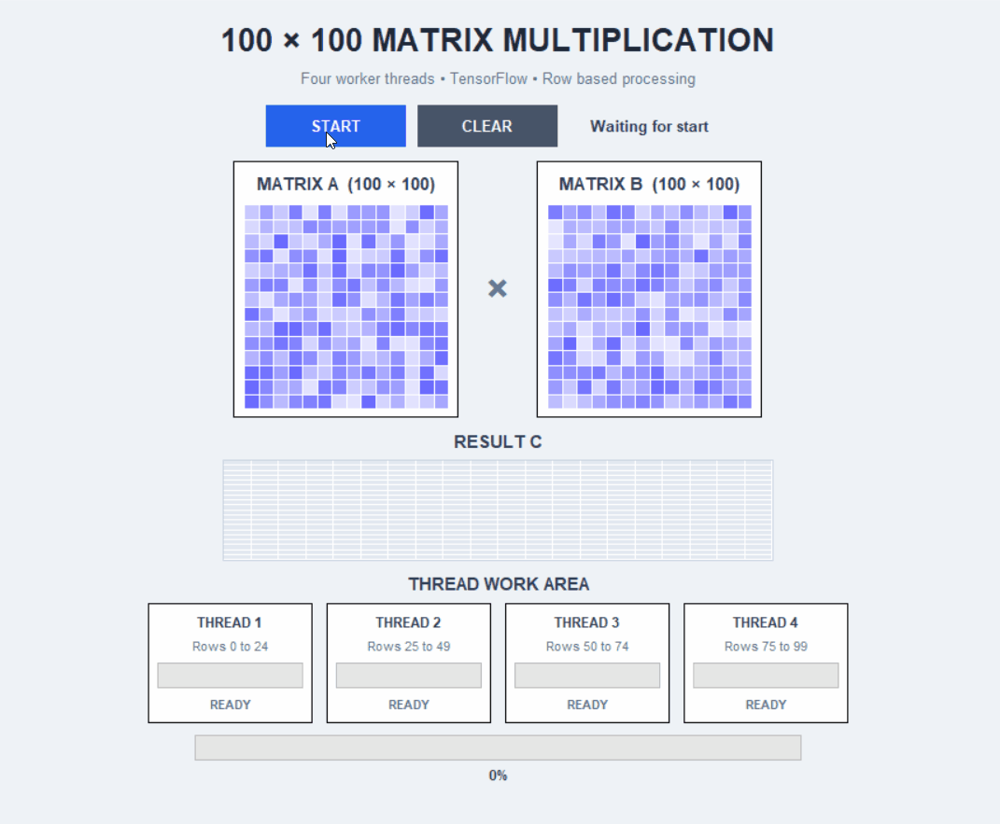

# Operating System Task 1

This repository contains programs developed for the Operating Systems task. The project demonstrates multithreading using Java and Python.

## Programs Included

### 🧵 1. Producer Consumer Problem

**File:** `ProducerConsumer.java`

This program demonstrates the Producer-Consumer problem using Java threads.

It uses a shared buffer where:

- The Producer adds items to the buffer.
- The Consumer removes items from the buffer.
- Threads work concurrently.
- Synchronization is used to coordinate access to the shared buffer.

  
## ▶️ How to Run
Using eclipse:
1. Create a Java project
2. Add producerConsumer.java to the src folder
3. Run it as a Java Application.

Using the Terminal:
```
 javac ProducerConsumer.java
 java ProducerConsumer
```

### 🔢 2. Multithreaded Matrix Multiplication

**File:** `multithread_matrix.py`

This program performs multiplication of two 100 × 100 matrices using four threads.

The rows of the matrix are divided among the threads:

- Thread 1 → Rows 0–24
- Thread 2 → Rows 25–49
- Thread 3 → Rows 50–74
- Thread 4 → Rows 75–99

The program also displays the execution time and a portion of the resulting matrix.

### 🎨 Matrix Multiplication Animation

**File:** `matrix_animation.py`

This is the graphical version of the matrix multiplication program.

The application provides:

- Matrix A and Matrix B visualization
- Result matrix visualization
- Four worker threads
- Individual thread progress
- Overall progress
- Start button
- Clear button
- Execution time
- TensorFlow-based matrix calculations

The GUI is created using Tkinter.

## ⚙️ Technologies Used

- Java
- Python
- TensorFlow
- Tkinter
- Python Threading
- Java Multithreading

## ⚓ Installation

Install TensorFlow:
 ```
 pip install tensorflow
```  

## ▶️ How to Run
Compile and run:
```
python multithread_matrix.py
python matrix_animation.py
```
The program will open a GUI window :
Click START to begin the matrix multiplication.
Click CLEAR to reset the result.

## Output




